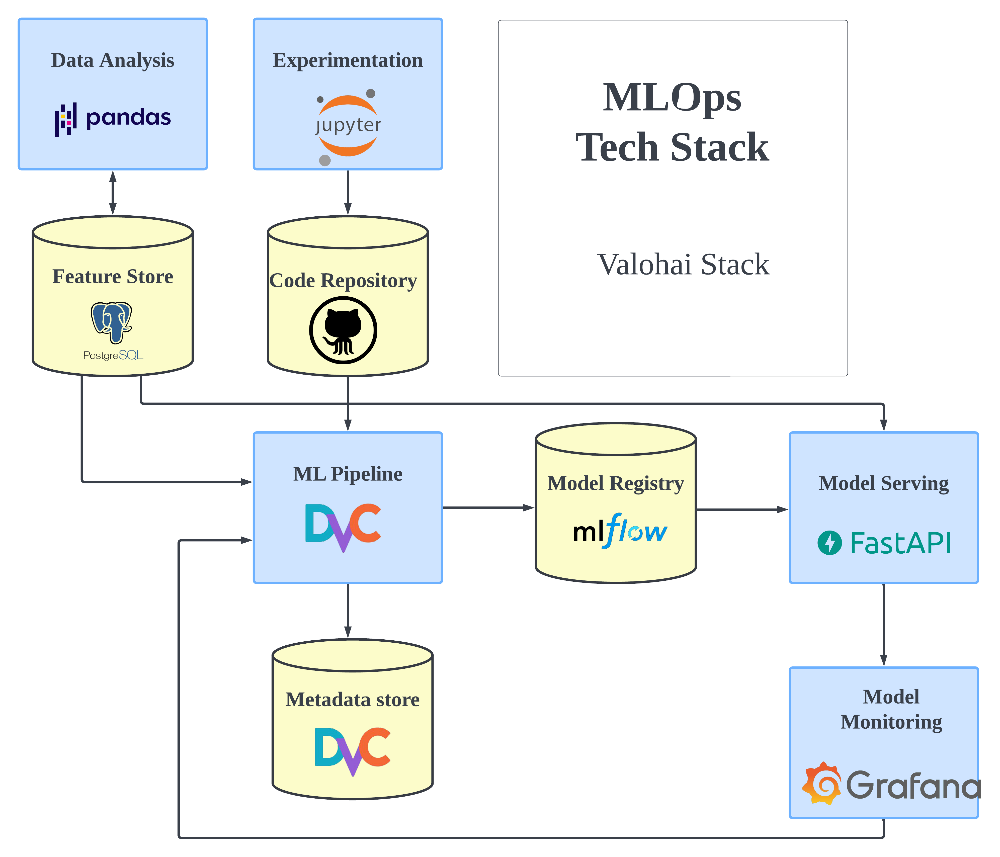
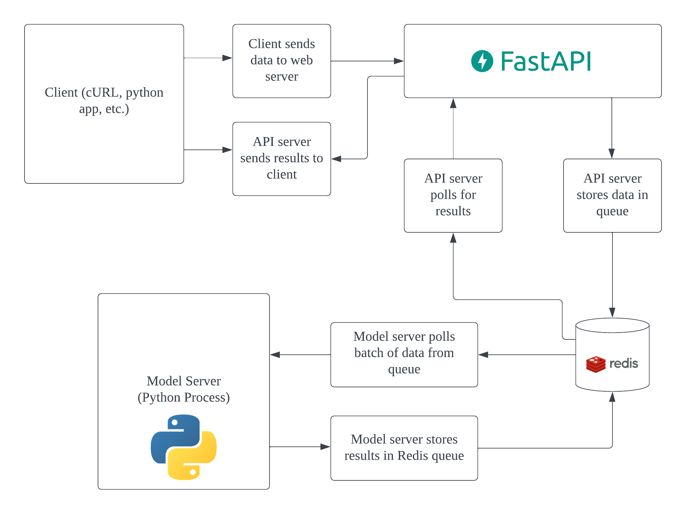

# MLOps Workflows

This repository contains workflows to version data with dvc, store models with Mlflow, deploy them with a scalable deployment architecture.

## Content Page

* [The Stack](#the-stack)
* [Production-ready model serving architecture](#production-ready-model-serving-architecture)
* [Mlflow architecture](#mlflow-architecture)
* [DVC Integration](#dvc-integration)
* [Monitoring](#monitoring)
* [Deploying services](#deploying-services)
* [Load Testing](#load-testing)
* [TODOs](#todos)

## The Stack

[Mlflow](https://github.com/mlflow/mlflow) is used to track the machine-learning model lifecycle, storing the hyperparameters and metrics of each model and versioning machine-learning models. It is also used as an artifact store to store the actual machine-learning model and used to download the model object using the mlflow python library.



## Production-ready model serving architecture

Serve a production-ready and scalable machine-learning model using FastAPI, Redis and Docker. Based off this [series of blog posts](https://www.pyimagesearch.com/2018/02/05/deep-learning-production-keras-redis-flask-apache/).



### Scalable

The service is split between the front-facing API, and the backend server that serves the model prediction. This allows us to dynamically scale either the front-facing API or the model server depending on load and scale of requests.

## [Mlflow architecture](https://mlflow.org/docs/latest/tracking.html#scenario-5-mlflow-tracking-server-enabled-with-proxied-artifact-storage-access)


Mlflow is deployed in a remote tracking server enabled with proxied artifact storage access. This allows a remotely managed mlflow instance that multiple clients in an organisation/company can upload/track their machine-learning experiments. This managed mlflow instance can also act as the central machine-learning model registry that offers discoverability to software engineers and data scientists in the organisation.

Notes:

* `--host` exposes the service on all interfaces
* `--port` exposes the mlflow service on the specified port
* `--backend-store-uri` configures the type of backend store, sets to a postgresql database instance
* `--serve-artifacts` enables the MLflow Artifacts service endpoints to enable proxied serving of artifacts through the REST API
* `--artifacts-destination` specifies the base artifact location from which to resolve artifact upload/download/list requests. In this examples, we're using a local directory `./mlartifacts`, but it can be changed to a s3 bucket or
* `--gunicorn-opts "--log-level debug"` is specified to print out request logs but can be omitted if unnecessary.

## DVC Integration

[DVC](https://dvc.org/) is used to manage training/raw data used to train models stored on mlflow. This allows data versioning for mlops.

## Monitoring

The FastAPI service exposes a prometheus metrics endpoint and grafana is used to create a dashboard to monitor the health of the various deployed services.

## Deploying Services

### Prerequisites

Make sure you have a modern version of `docker` (>1.13.0)and `docker-compose` installed.

### Run with Docker Compose

#### Spin up mlflow with s3 artifact store and postgres data store

Run `make start-mlflow`

#### Spin up grafana monitoring service

Run `make start-grafana`

#### Spin up deployment API service

Run `make deploy-all`

### Test Service

* Test the `/predict` endpoint by passing in the included `doge.jpg` as parameter `img_file`:

```bash
curl -X POST -F img_file=@doge.jpg http://localhost/predict
```

You should see the predictions returned as a JSON response.

## Load Testing

We can use [locust](https://locust.io) and the included `locustfile.py` to load test our service. Run the following command to spin up `20` concurrent users immediately:

```bash
locust --host=http://localhost --no-web -c 20 -r 20
```

The `--no-web` flag runs locust in CLI mode. You may also want to use locust's web interface with all its pretty graphs, if so, just run `local --host=http://localhost`.

## TODOs

* add [mlflow integration](https://github.com/mlflow/mlflow/tree/master/examples/mlflow_artifacts)
* Makefile for one-command deployment
* add dvc
* add starting container to train a model and publish to mlflow
* readme documentation
